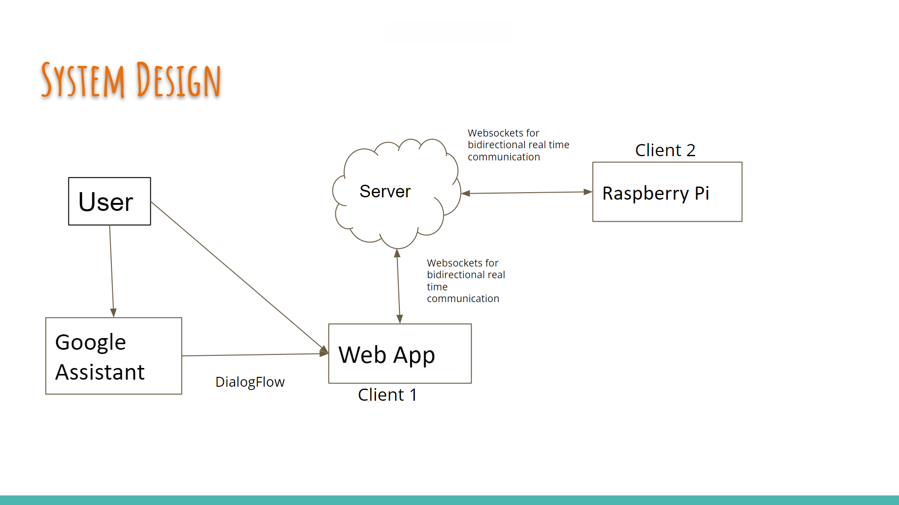
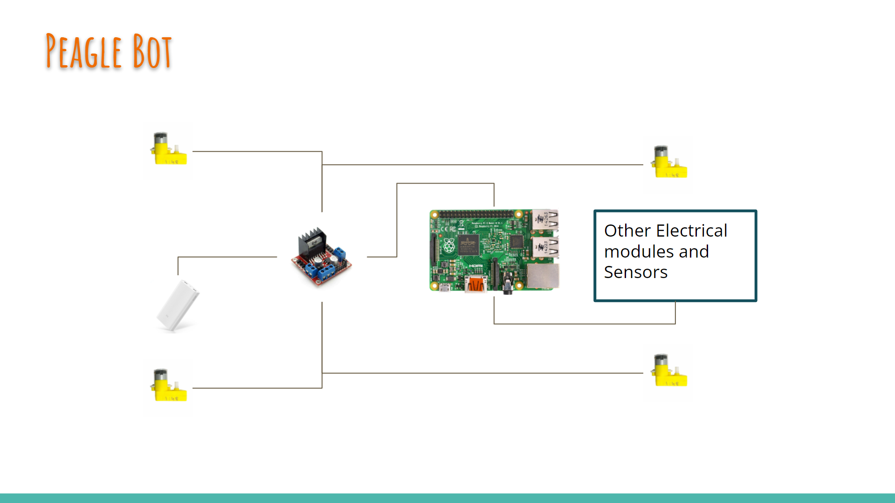
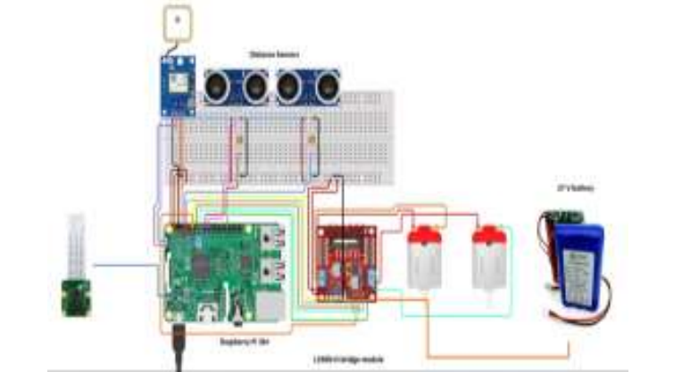
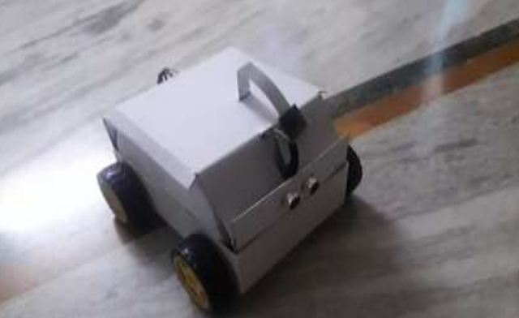

# **Peagle** 
## Control your bot from anywhere !!

**Overview**

Peagle is a webapp that uses socket.io. to implement **web sockets** for live communication between user and robot. A Server running the web app acts as mediator between the two. 

**The Robot**

The robot here is a raspberry pi operated car robot. The wheels (motors) were controlled via L298N H-Bridge. It had sensors like GPS and Distance Sensors which sent required information to server and ultimately to user and was backed up by a 27V battery. 
**Nodejs** is used to run server and implement websockets, while **Python** is used to control and send signals to electronic parts and ultimately control the robot.

**[Peagle Web App](https://github.com/shivam101gaur/peagle#readme)**

User can login by using thier creditionals and then access control panel page. User can send instructions to car through that page in webapp. The web app uses HTML, CSS, JS, PHP, NODE JS. Though this project was based on a car robot but this app could be extended to other robots and gadgets and modified accordingly. More features and technologies (google action and others) could be added to project and make it more featured and user-friendly

## Usage
- **Step 1** : [Run server.js](https://github.com/shivam101gaur/peagle#readme) 


  ```
   node server.js
  ```
- **Step 2** : Switch on  raspberry pi  and then
    run index.js in Raspberry-Pi 
    ```
     sudo node index.js
    ```
 - **Step 3** : Open webapp on web browser 

## Published Paper
  - http://www.ijirt.org/Article?manuscript=149689


## **Project Design**
  

  

  

  


## Developer
- [Shivam Gaur](https://github.com/shivam101gaur)
